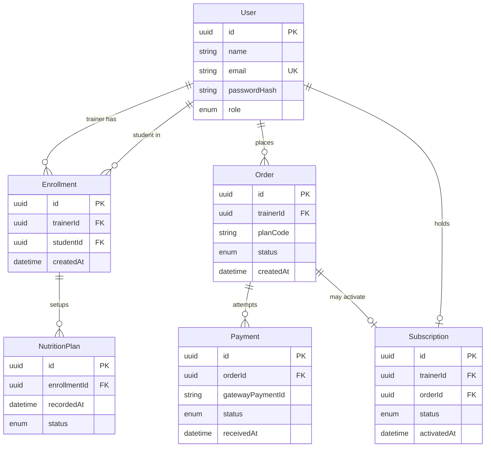

# 🛠️ Architecture / Software Design Document

**Projeto:** Zenith Tracker
**Versão:** 1.0.0
**Última atualização:** 2026-09-09

> 🤖 **O `prd.md` responde _o quê_ o produto faz. Este responde _onde as coisas
> moram e como se chamam_.** Detalhe de tela — rota, componente, contrato —
> **não** se decide aqui: isso é trabalho da spec de cada história.

---

## 🤖 1. Fontes de Contexto para a IA

> Onde a IDE agêntica busca a verdade. **Isto é o índice; a configuração mora
> nos arquivos** — documento não configura ferramenta.

| Fonte | Onde configurar | Serve para |
| :---- | :-------------- | :--------- |
| Constituição da IA | `.agents/rules/utf-rules.md` (via `CLAUDE.md`) | Regras inegociáveis: fases do SDD, 2 rodadas, revisores distintos, Git |
| Fluxos da IA | `.agents/workflows/` | PRD, backlog, jornadas e tokens, architecture, setup, ciclo por Issue, ciclo por tarefa, tutor |
| Agentes (subagentes) | `.agents/agents/` (cascas em `.claude/`, `.cursor/` e `.opencode/`) | Implementador, revisores, auditor final e tutor |
| Ficha da disciplina | `docs/checklist.md` | Regras do projeto, IDs e entregas |
| Design (Figma/Stitch) | pendente — ver `docs/design-tokens.md` | Cores, tipografia, hierarquia visual |

---

## 📦 2. Stack Tecnológica

> Definição **estrita**: nenhuma dependência entra sem aparecer aqui. Esta
> seção e o `package.json` contam a mesma história, ou o projeto já se perdeu.
> O pin exato vive no `package.json` de cada app; aqui vai a **major**.

**Runtime:** Node.js **24** (LTS). NestJS 12 + Jest 30 exigem Node **24.9+** para carregar os pacotes ESM do Nest; a receita Prisma 8 + Nest pede Node 24.

- **Backend:** NestJS **12** (projeto **CommonJS** — `nest new --type cjs`) + Prisma ORM **8** + PostgreSQL
- **Frontend:** React via Next.js **16** (App Router). Next.js é só a casca da UI — ver §4
- **Padrões de código do frontend:** componentes de função com hooks (sem classes); estado do servidor separado do estado de UI; páginas do App Router distintas de componentes reutilizáveis; telas interativas e qualquer código que carregue JWT são Client Components (`'use client'`). **Componente não fala com o servidor** — todo acesso à API NestJS passa por repositório
- **Estilo:** Tailwind CSS **4** (padrão do `create-next-app` 16). Tokens de `docs/design-tokens.md` entram em `@theme` no CSS global. Cor, espaço e tipo crus fora desse mapa são defeito
- **Testes:**
  - `apps/api`: **Jest** + **oxlint** (gerador CJS do Nest 12)
  - `apps/web`: **Vitest** + Testing Library + **ESLint** (`eslint`, não `next lint`)
- **Pagamento:** Mercado Pago (Checkout Pro) em **sandbox**
- **Banco local:** PostgreSQL via Docker Compose na raiz
- **Banco de produção:** Vercel Postgres, com URL de *connection pooling* do Prisma

### Dependências além do gerador

O `nest new` / `create-next-app` trazem o esqueleto. **Só entra no projeto o que está nesta lista** (além do que o gerador já instala):

| App | Pacote | Por quê |
| :-- | :----- | :------ |
| `api` | `@nestjs/config` | `ConfigModule`; segredos só em env (ID17) |
| `api` | `@nestjs/jwt`, `@nestjs/passport`, `passport`, `passport-jwt` | JWT + Guards (ID9) |
| `api` | `bcrypt` | hash de senha; a senha em claro não persiste |
| `api` | `class-validator`, `class-transformer` | DTOs + `ValidationPipe` com whitelist (ID7) |
| `api` | `@nestjs/swagger` | contrato vivo (ID14) |
| `api` | `prisma` (major 8) | ORM; contrato em `src/prisma/contract.prisma` |
| `api` | `mercadopago` | checkout e verificação do webhook (ID20, ID21) |
| `web` | `vitest`, `@vitejs/plugin-react`, `jsdom`, `@testing-library/react`, `@testing-library/dom`, `vite-tsconfig-paths` | suíte do front (não vem no `create-next-app`) |

### 🧱 2.1. Backend — regras estruturais

> Critério fixo dos revisores. Camada que furar isso é apontamento.

**Camadas (ID6).** Um módulo Nest por domínio. O **controller** recebe HTTP, valida o DTO e chama o service — não importa Prisma, não monta SQL, não chama o gateway. O **service** contém a regra e orquestra repositório/gateway. O **module** só registra providers. Prisma não aparece no controller.

**Entrada (ID7).** Todo body/query de escrita passa por DTO com `class-validator`. `ValidationPipe` global: `whitelist: true`, `forbidNonWhitelisted: true`, `transform: true`. Campo a mais na entrada é 400.

**Dados (ID8).** Único acesso ao PostgreSQL: `PrismaService` (receita Prisma 8 + Nest: cliente em `src/prisma/db.ts`). Service de domínio não instancia o cliente. CRUD relacional via Prisma; migração/contrato no repositório, nunca `db push` silencioso em produção.

**Autenticação e papel (ID9).** Login devolve JWT. Rotas autenticadas: `Authorization: Bearer <token>`. `AuthGuard` (JWT) + `RolesGuard` (`STUDENT` \| `TRAINER`). Visitante só nas rotas públicas de cadastro/login. Tentativa de aluno nas rotas de treinador (e o inverso) é 403, sem vazar o recurso.

**Resposta e erro (ID10).** Interceptor global de sucesso: `{ statusCode, data }`. Exception filter global: `{ statusCode, message, error }`. Sem stack, senha, token ou chave de gateway no corpo, no log commitável ou no Swagger de exemplo.

**Segredos (ID17, ID21).** `ConfigModule` lê `.env` local (arquivo gitignored) e as variáveis da plataforma em CI/produção. `DATABASE_URL`, `JWT_SECRET`, chaves do Mercado Pago e segredo do webhook **nunca** aparecem no Git, em YAML de workflow em claro, nem neste documento.

**Pagamento (ID20, ID21).** O Pedido (`Order`) nasce na API, já `PENDING`, **antes** do redirecionamento. O checkout é o Mercado Pago (sandbox). Quem muda `Order` para `PAID` / `REFUSED` / `EXPIRED` é o **webhook** autenticado (verificação de assinatura). A tela de retorno do Next **não** confirma pagamento: só consulta o Pedido. Notificação que falha na assinatura não altera Pedido nem `Subscription`. Chaves fora do repositório.

**CI (ID18).** GitHub Actions no Pull Request: lint + suíte de `apps/api` e `apps/web`. Postgres de serviço no job (espelha o Compose). Sem `DATABASE_URL` de produção no workflow.

### 🌐 2.2. O contrato da API

Documentação **OpenAPI/Swagger** gerada do código (`@nestjs/swagger`) e servida pela própria API em **`/docs`**.

O frontend deriva os contratos dessa documentação viva. Este arquivo **não mantém tabela de endpoints**. O artefato gerado (`swagger.json` ou equivalente) **não é commitado**.

Autenticação no Swagger: esquema Bearer JWT, o mesmo das rotas protegidas.

---

## 🗂️ 3. Estrutura do Repositório (Monorepo)

> Uma pasta por aplicação, cada uma com o seu `package.json`. **Sem** npm
> workspaces, Nx ou Turborepo.

```text
.
├── .agents/
├── .claude/ .cursor/ .opencode/
├── .github/
├── CLAUDE.md  AGENTS.md
├── README.md
├── docker-compose.yml     # PostgreSQL local
├── docs/
├── specs/
└── apps/
    ├── api/               # NestJS 12 CJS + Prisma 8
    │   ├── src/
    │   │   ├── auth/              # JWT, strategies, guards
    │   │   ├── users/
    │   │   ├── enrollments/
    │   │   ├── nutrition-plans/
    │   │   ├── orders/
    │   │   ├── payments/          # webhook Mercado Pago
    │   │   ├── subscriptions/
    │   │   ├── common/            # interceptor, filter, pipe
    │   │   ├── prisma/            # contract.prisma, db.ts, queries
    │   │   └── prisma.service.ts
    │   └── test/                  # e2e Jest
    └── web/               # Next.js 16 (sem Route Handlers)
        ├── app/                   # rotas (páginas), não API
        ├── components/            # reutilizáveis — não são página
        ├── repositories/          # único fetch à API NestJS
        └── lib/
```

Cada app tem o seu `package.json`. Instalar e testar: `cd apps/api` ou `cd apps/web`.

### Como rodar os testes e o lint

Comandos **exatos** (a partir da pasta do app). CI usa a variante `run` do Vitest e o `jest` sem watch.

| App | Suíte | E2E | Lint |
| :-- | :---- | :-- | :--- |
| `apps/api` | `npm test` (`jest`) | `npm run test:e2e` (`jest --config ./test/jest-e2e.json`) | `npm run lint` (`oxlint src/ test/`) |
| `apps/web` | `npm test` (`vitest`); no CI: `npx vitest run` | — | `npm run lint` (`eslint`) |

---

## 🏗️ 4. Arquitetura Frontend

> **Componente não fala com o servidor.** Toda chamada HTTP à API NestJS passa
> por `apps/web/repositories/`. Mudança de contrato mexe só nessa camada.

**Next.js 16 é UI, não backend.** Proibido no `apps/web`:

- `app/api/**` e Route Handlers
- Server Actions que gravem banco, falem com Mercado Pago ou substituam a API
- `fetch` a NestJS a partir de Server Component (o JWT mora no cliente; o ID16 pede consumo assíncrono da API NestJS com token)

Páginas em `app/` (App Router, um segmento por área: aluno / treinador). Componentes reutilizáveis em `components/`. Repositórios usam `Authorization: Bearer` e tratam 401/403 sem vazar detalhe de senha ou de qual campo falhou no login.

Estado de servidor (dados da API) não se mistura com estado de UI (modal aberto, passo do wizard).

---

## 🗄️ 5. Arquitetura de Dados

### 📖 5.1. Glossário Técnico (Mapeamento)

> **Dados e código em inglês, interface em português.**

| Termo PRD (PT-BR) | Entidade técnica (EN) | Atributos principais |
| :---------------- | :-------------------- | :------------------- |
| Conta (aluno ou treinador) | `User` | `id`, `name`, `email` (único), `passwordHash`, `role` (`STUDENT` \| `TRAINER`) |
| Vínculo | `Enrollment` | `id`, `trainerId`, `studentId`, `createdAt` — único por par |
| Plano nutricional | `NutritionPlan` | `id`, `enrollmentId`, antropometria, rotina, objetivo, teto/macros (sugerido + vigente), `errorMarginKcal`, `status`, `recordedAt` — cada gravação é um setup novo |
| Pedido | `Order` | `id`, `trainerId`, `planCode`, `status` (`PENDING` \| `PAID` \| `REFUSED` \| `EXPIRED`), `createdAt` |
| Pagamento | `Payment` | `id`, `orderId`, ids do gateway, `status`, `receivedAt` |
| Assinatura | `Subscription` | `id`, `trainerId`, `orderId` que ativou, `status` (`ACTIVE` \| `INACTIVE`), `activatedAt` |

**Não são tabela:** Motor, teto do dia, meta do dia, medidor sincero — cálculo ou leitura sobre o plano vigente e os registros do dia (estes últimos nascem nas specs Should/Could).

Visitante não é entidade: é ausência de sessão.

### 📊 5.2. Diagrama ER (Mermaid)

Escopo Must Have + 1:N da ficha (`User`–`Enrollment`, `Order`–`Payment`). Should/Could não entram até a spec correspondente.



Unicidade: `User.email`; par (`trainerId`, `studentId`) em `Enrollment`; no máximo um `Order` `PENDING` por treinador.

### 🌍 5.3. O banco por ambiente

| Ambiente | Onde roda | Como conecta |
| :--- | :--- | :--- |
| **Local** | PostgreSQL no Docker Compose da raiz | `DATABASE_URL` no `.env` de `apps/api` (gitignored) |
| **CI** | Serviço Postgres no GitHub Actions | `DATABASE_URL` injetada no job, apontando ao serviço — não é a de produção |
| **Produção** | Vercel Postgres | `DATABASE_URL` nos secrets da plataforma, **URL de pooling** do Prisma |

> 🔒 Credenciais **nunca** aparecem no repositório — nem em código, nem em
> YAML, nem em doc. Só nos *secrets* da plataforma.

---

## 🗺️ 6. Mapa de Domínios

> **Este índice cresce.** Uma linha por história implementada. Rota e contrato
> ficam no Swagger (`/docs`) e na spec — nunca copiados aqui.

| Domínio | Módulo (pasta) | Guard | Dados (repository) | US |
| :------ | :------------- | :---- | :----------------- | :-- |
| | | | | |

---

## 📅 7. Histórico

| Data | Versão | O que mudou |
| :--- | :------ | :---------- |
| 2026-09-09 | 1.0.0 | Versão inicial via `/utf-architecture` |

---

## 🛑 O que ainda **não** está neste documento

Detalhes de funcionalidade — DTOs de endpoints específicos, máquinas de estado
de uma história — **não entram aqui**: nascem sob demanda no `spec.md` de cada
história. Este documento guarda só o que vale para o sistema inteiro.
