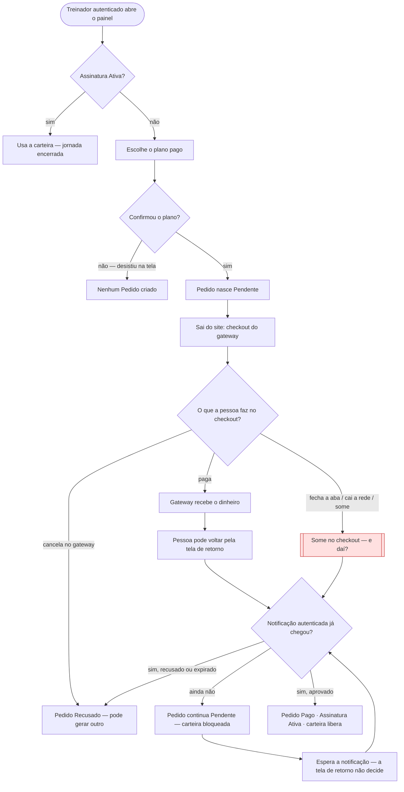

# 🗺️ Jornadas de Usuário

**Projeto:** Zenith Tracker
**Versão:** 1.0.0
**Última atualização:** 2026-09-08

> 🤖 **Este documento é a fonte da verdade sobre O QUE A PESSOA VIVE na tela** —
> o caminho do primeiro clique até o objetivo, e principalmente os pontos onde ela
> trava, espera ou desiste.
>
> 🚫 **Não duplique:** regra de negócio mora no `prd.md`; estado, entidade e contrato
> moram no `architecture.md`. Aqui mora o caminho.

---

## Jornada 1 — Contratar e confirmar a assinatura do painel

**Story:** US05, US06
**Critérios que ela marca:** sai do site e volta · depende do tempo · depende de outra pessoa · pode ser abandonada

O treinador já tem conta (US01). Sem Assinatura Ativa ele entra no painel e vê que a carteira ainda não libera (RN16). Esta jornada é o caminho até o painel de verdade — e o ponto em que a maioria dos produtos mente para si mesma: tratar a tela de “obrigado” como se fosse pagamento.

**O que decidimos sobre o nó vermelho:**

Se a pessoa fecha a aba no checkout, a tela de retorno nunca abre — e isso não pode significar nem “pago” nem “desistiu”. O Pedido já existe como Pendente desde antes de sair do site; ele fica Pendente até a notificação autenticada do gateway chegar. Quem decide que foi pago é essa notificação, não o botão de voltar. Quando a pessoa reabre o painel depois, o produto consulta o Pedido: se a notificação já tiver aprovado, a Assinatura está Ativa e a carteira libera; se ainda não chegou, mostra que o pagamento está em aberto e não inventa sucesso; se o gateway recusou ou deixou expirar, o Pedido fecha nesses estados e ela pode contratar de novo. Tratar a tela de retorno como fonte da verdade liberaria o painel para quem só chegou na página de obrigado, e travaria para quem já pagou mas fechou a aba — os dois erros que esta jornada existe para não cometer.
